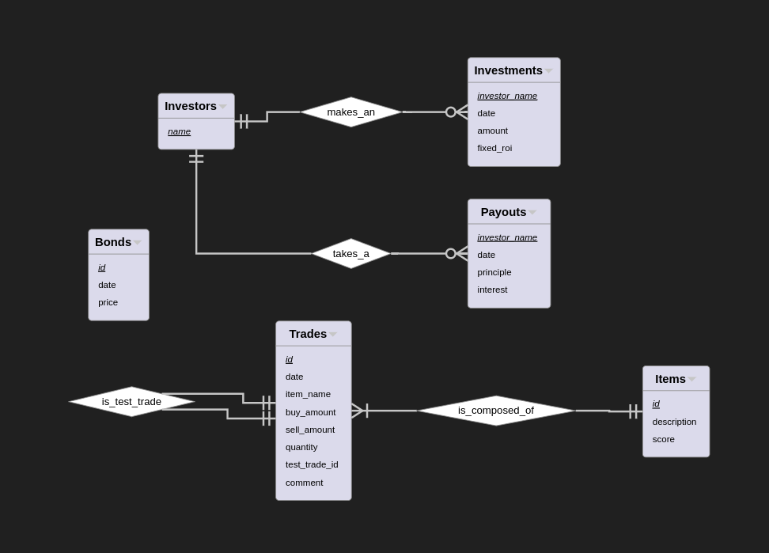

# Overview
For years, I've used an elaborate spreadsheet to flip/merch on Runescape. This project (placeholder name *Guêpe Program*) aims to build a local program built with Python that acts as a GUI to interact with a PostgreSQL database.

The program will facilitate keeping track of test trades, ongoing trades, realized trades, and provide a collection of statistics and graphs to help the user examine their trading history.

# Requirements
- This needs to be better than using a Google Sheet to flip:
	- It needs to be easier to use for actual flipping
	- It needs to give me more information about trades
	- It needs to be better at keeping track of investor information (optional)
	- It needs to be as satisfying to use
	- It needs to be persistent
	- It needs to be transportable
- The program needs to appeal to flippers/merchers

# TODOs
- [x] Create a GitHub repo, structure it correctly
- [x] Create a README
- [x] Design a database model and relationships normalized to 3NF
- [x] Create crowfoot's notation for databases
- [ ] Learn more about containers, Docker Desktop, and retrieving the "volume" in PostgreSQL for upload to GitHub or other backup methods
- [ ] Get a deeper understanding of GE Flipping to better meet needs of users
	- https://www.ge-tracker.com/landing/osrs-flipping
- [ ] Examine my program's ethical impacts and intended audience
- [ ] Discuss with other flippers what design would be most helpful
- [ ] Inform myself on FOSS and how it could apply to this program
	- https://en.wikipedia.org/wiki/Free_and_open-source_software
	- https://en.wikipedia.org/wiki/GNU_Project
- [ ] Design a program & workflow model for the Python/UI of the program
- [ ] Create backend (make a Python script to get my initial database into SQL)
- [ ] Find a library or other method to generate graphs & reports for user (optionally investors as well)
- [ ] Publicize software

# Database Design
## ERD Diagram

## Relational Model
- **Items**(<u>name</u>: STRING, description: STRING, score: INT)
- **Trade**(<u>id</u>: INT, date: DATE, item_name: STRING, buy_amount: FLOAT, sell_amount: FLOAT, quantity: INT, test_trade_id: INT, comment: STRING)
- **Investors**(<u>name</u>: STRING)
- **Investments**(<u>investors_name</u>: STRING, date: DATE, amount: FLOAT, fixed_roi: FLOAT)
- **Payouts**(<u>investors_name</u>: STRING, <u>date</u>: DATE, principle: FLOAT, interest: FLOAT)
- **Bonds**(<u>id</u>: INT, date: DATE, price: FLOAT)